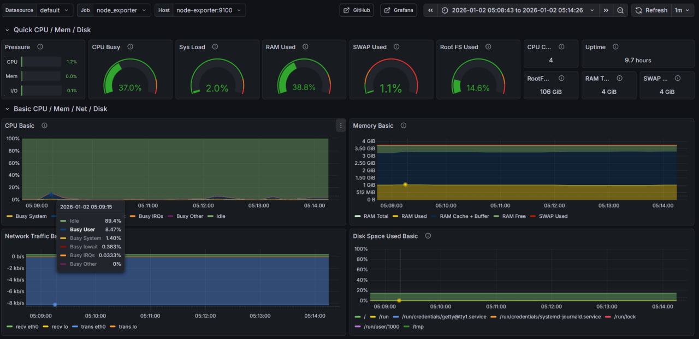
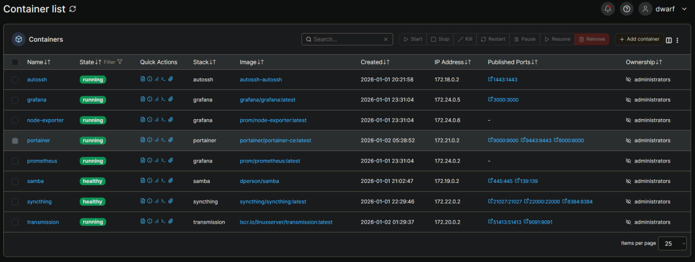

# Home Server Services

> **Home Server Services** - это полный набор сервисов в Docker для организации моего домашнего сервера!
>
> Главное - это **модульность** и **воспроизводимая установка**. Можно развернуть за 15 минут!




## Сервер:

- CheckWay POS88
  - [Intel Celeron J1900](https://technical.city/ru/cpu/Core-2-Duo-E8400-protiv-Celeron-J1900) @ 1.99GHz (64 bit)
  - 4Gb RAM
  - 120Gb SSD
  - Не греется, не шумит, мало потребляет
- Debian 13 (Trixie) Minimal
  - [Docker](https://www.docker.com/)
  - [Docker Compose](https://docs.docker.com/compose/)
  - Политика частоты работы CPU - `ondemand`

## Сервисы:

- [Portainer](./portainer/) - Управление контейнерами
- [Grafana](./grafana/) - Загруженность сервера
  - [Prometheus](./grafana/prometheus.yml)
  - [Node Exporter](./grafana/)
- [Samba](./samba/) - Сетевой диск
- [Syncthing](./syncthing/) - Синхронизация данных между устройствами
- [Transmission](./transmission/) - BitTorrent клиент
- [AutoSSH](./autossh/) - SSH тунель

## О проекте:

- **Полнофункциональный домашний сервер** на Docker
- **Все сервисы настроены через Docker Compose** для легкого управления и быстрого запуска
- Мониторинг системы через Grafana с готовыми дашбордами
- **Файловый сервер Samba** для доступа к файлам по сети
  - Открытый диск только на чтение
  - Доступ на запись только после авторизации
- **Синхронизация файлов** между устройствами через **Syncthing**
  - Постоянная точка синхронизации позволяет обмениваться файлами между устройствами, даже если они не бывают одновременно в сети - домашний сервер выступает посредником
- **BitTorrent клиент Transmission** с веб-интерфейсом
- **SSH туннелирование через AutoSSH**
  - Можно пробросить порт на удалённый VPS, автоматически переподключается при потере соединения
- Управление Docker через **Portainer с веб-интерфейсом**
- Скрипт для снижения энергопотребления CPU
- Все **сервисы используют переменные окружения** для гибкой настройки и примеры конфигураций
- Автоматический перезапуск контейнеров при сбоях

## Запуск:

1. **Настройте переменные окружения:**
   Создайте файл `.env` в директории сервиса с необходимыми переменными по шаблону.

   ```bash
   cd <service-folder>
   cp .env.example .env
   ```

   Отредактируйте `.env` под свои задачи.

2. **Запустите нужные сервисы:**
   ```bash
   docker-compose -f portainer/docker-compose.yml up -d
   docker-compose -f grafana/docker-compose.yml up -d
   docker-compose -f samba/docker-compose.yml up -d
   docker-compose -f syncthing/docker-compose.yml up -d
   docker-compose -f transmission/docker-compose.yml up -d
   docker-compose -f autossh/docker-compose.yml up -d
   ```
