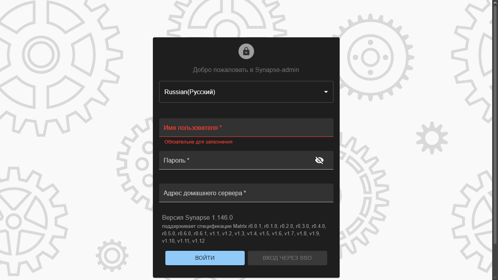

# 🏠 Home Server Services

> **Home Server Services** — это гайд по настройке и полный набор сервисов в Docker для организации домашнего роутера/сервера!
>
> Главное — это **модульность** и **воспроизводимая установка**.

---

## 📋 Мой сервер

- **CheckWay Sherman Micro**
  - [Intel Celeron J1900](https://technical.city/ru/cpu/Core-2-Duo-E8400-protiv-Celeron-J1900) @ 1.99GHz (64 bit)
  - 8GB RAM
  - 120GB SSD
  - 2x 1Gbps (WAN+LAN)
- **Proxmox VE 9.1.4**
  - **OPNsense 25.7**
    - [CrowdSec](https://www.crowdsec.net)
    - [AdGuard Home](https://github.com/AdguardTeam/AdGuardHome)
  - **Debian 13 (Trixie) Minimal**
    - [Podman](https://podman.io)

---

## 🚀 О проекте

- **Полнофункциональный домашний сервер**
- Две одновременно запущенные операционные системы в гипервизоре Proxmox
  - OPNsense выполняет функции роутера, DHCP и NTP сервера, защищает домашнюю сеть от вторжений с CrowSec
  - В Debian в Podman запущены контейнеры с сервисами
- **Все сервисы настроены через Docker Compose** (совместим с Podman) для легкого управления и быстрого запуска
- **Мониторинг системы через Grafana** с готовым дашбордом
- **Файловый сервер Samba** для доступа к файлам по сети
  - Открытый диск только на чтение
  - Доступ на запись только после авторизации
- **Синхронизация файлов** между устройствами через **Syncthing**
  - Постоянная точка синхронизации позволяет обмениваться файлами между устройствами, даже если они не бывают одновременно в сети — домашний сервер выступает посредником
- **BitTorrent клиент Transmission** с веб-интерфейсом
- **SSH туннелирование через AutoSSH**
  - Можно пробросить порт на удалённый VPS, автоматически переподключается при потере соединения
- **Nginx reverse proxy** для маршрутизации трафика к сервисам
  - Автоматическое получение и обновление SSL сертификатов через Let's Encrypt
  - Автоматическое обновление DNS записей у регистратора [рег.ру](https://www.reg.ru)
- **Git-сервер Gitea** для хостинга репозиториев
- **FileBrowser** — веб-интерфейс для управления файлами через браузер
- **Matrix Synapse** — собственный сервер для мессенджера Matrix с веб-клиентом Element и административной панелью
- Блокировка рекламы, нежелательной слежки, частичная защита от атак с помощью **AdGuard Home**
- Управление контейнерами через **Portainer**
- Все **сервисы используют переменные окружения** для гибкой настройки и примеры конфигурации

---

## 📝 Подготовка

Перед началом установки необходимо выполнить следующие шаги:

1. **Купить белый IP адрес** у провайдера
2. **Купить домен второго уровня** у регистратора [рег.ру](https://www.reg.ru)
3. [В настройках API рег.ру](https://www.reg.ru/user/account/settings/api/) добавить CIDR вашего провайдера (чтобы при смене IP наш скрипт смог обновить DNS записи)
4. В настройках DNS-серверов зоны указать бесплатные DNS-серверы рег.ру: `ns1.reg.ru`, `ns2.reg.ru`

> После выполнения этих шагов можно переходить к настройке сервера. **[Первым шагом установим гипервизор Proxmox](./Proxmox.md)**. Вы также можете установить [Debian с сервисами отдельно, если у вас уже настроен роутер](./Debian.md)

---

## 🎯 Использование

### Внутренние сервисы

После настройки и запуска внутренние сервисы доступны (по умолчанию) по следующим портам:

#### Grafana — порт `3000`

#### Portainer — порт `9000`

#### Transmission — порт `9091`

#### Syncthing — порт `8384`

#### Matrix Admin — порт `8009`

### Внешние сервисы

Внешние сервисы запустятся на указанных в конфиге nginx поддоменах:

#### Gitea

#### Synapse и Element

| Synapse | Element |
|---------|---------|
|  |  |

#### FileBrowser

