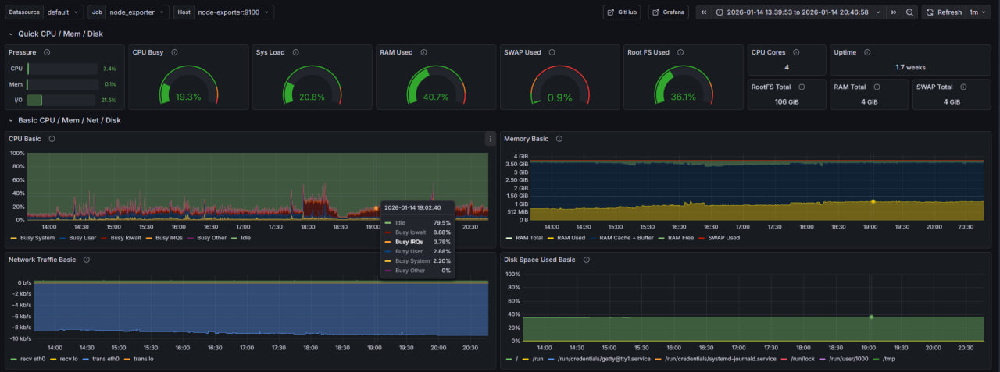
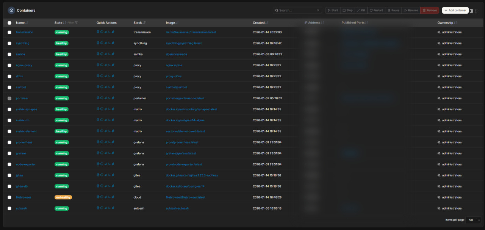
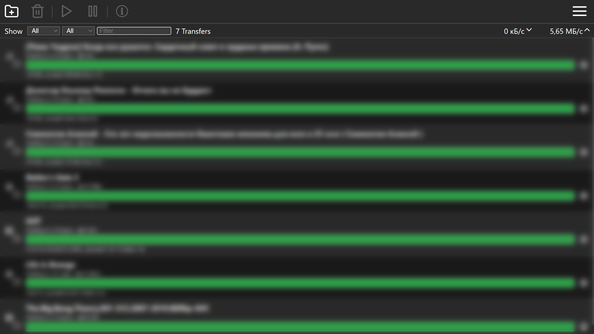
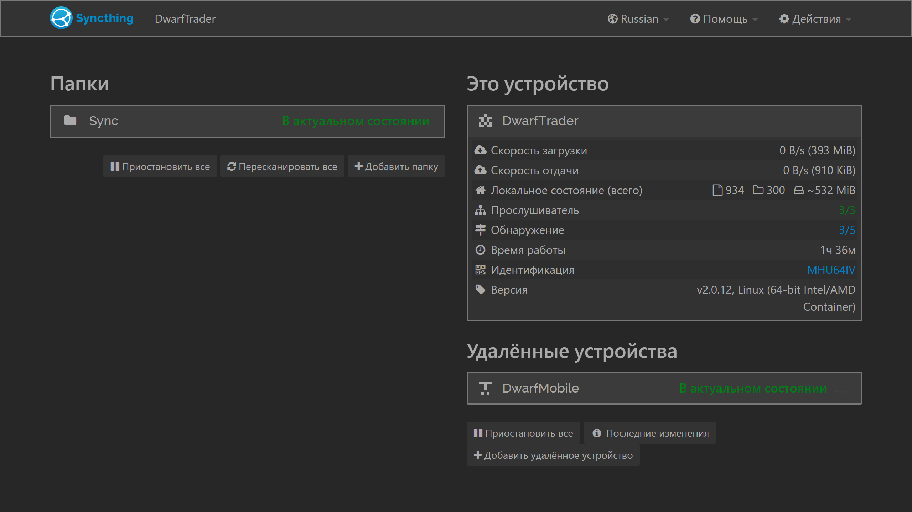
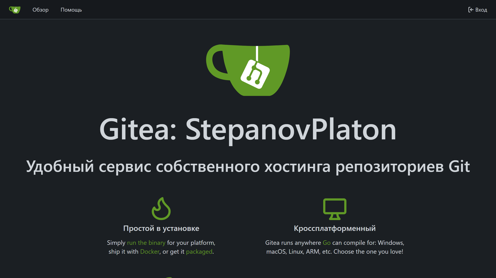
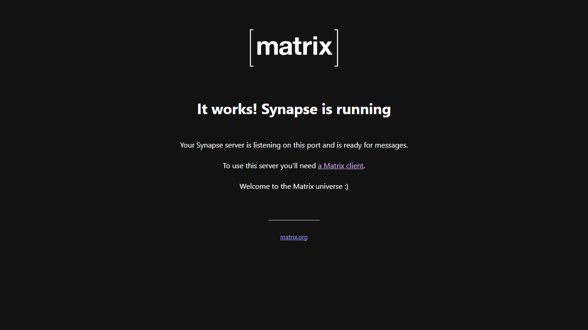
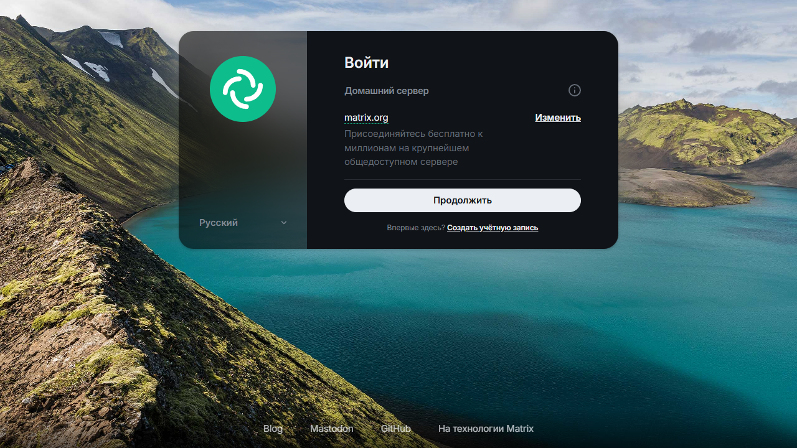
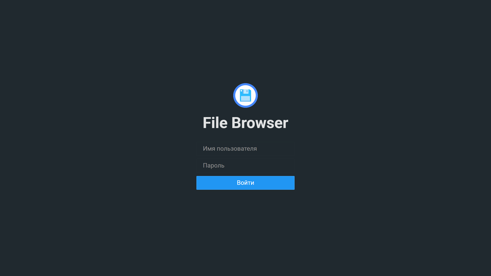

# Home Server Services

> **Home Server Services** - это полный набор сервисов в Docker для организации домашнего сервера!
>
> Главное - это **модульность** и **воспроизводимая установка**. Можно развернуть за 15 минут!




## Мой сервер:

- CheckWay POS88
  - [Intel Celeron J1900](https://technical.city/ru/cpu/Core-2-Duo-E8400-protiv-Celeron-J1900) @ 1.99GHz (64 bit)
  - 4Gb RAM
  - 120Gb SSD
  - Не греется, не шумит, мало потребляет
- Debian 13 (Trixie) Minimal
  - [Docker](https://www.docker.com/)
  - [Docker Compose](https://docs.docker.com/compose/)
  - Политика частоты работы CPU - `ondemand`

## Сервисы:

- [Portainer](./portainer/) - Управление контейнерами
- [Grafana](./grafana/) - Загруженность сервера
  - [Prometheus](./grafana/prometheus.yml)
  - [Node Exporter](./grafana/)
- [Proxy](./proxy/) - Reverse proxy
  - [Nginx](./proxy/nginx/)
  - [DDNS](./proxy/ddns/) - Автоматическое обновление DNS записей у регистратора [рег.ру](https://www.reg.ru)
  - Let's Encrypt - Автоматическое обновление SSL сертификатов на все домены
- [Samba](./samba/) - Сетевой диск
- [Syncthing](./syncthing/) - Синхронизация данных между устройствами
- [Transmission](./transmission/) - BitTorrent клиент
- [AutoSSH](./autossh/) - SSH тунель
- [Gitea](./gitea/) - Git-сервер
- [Cloud](./cloud/) - FileBrowser - веб-интерфейс для управления файлами
- [Matrix](./matrix/) - сервер Matrix
  - [Synapse](./matrix/create_config.sh) - Matrix сервер Synapse
  - [Element](./matrix/docker-compose.yml) - Matrix веб-клиент Element
- [Pi-hole](./pihole/) - DNS фильтр (блокировка рекламы, слежки, защита от атак)

## О проекте:

- **Полнофункциональный домашний сервер**
- **Все сервисы настроены через Docker Compose** для легкого управления и быстрого запуска
- **Мониторинг системы через Grafana** с готовыми дашбордами
- **Файловый сервер Samba** для доступа к файлам по сети
  - Открытый диск только на чтение
  - Доступ на запись только после авторизации
- **Синхронизация файлов** между устройствами через **Syncthing**
  - Постоянная точка синхронизации позволяет обмениваться файлами между устройствами, даже если они не бывают одновременно в сети - домашний сервер выступает посредником
- **BitTorrent клиент Transmission** с веб-интерфейсом
- **SSH туннелирование через AutoSSH**
  - Можно пробросить порт на удалённый VPS, автоматически переподключается при потере соединения
- **Nginx reverse proxy** для маршрутизации трафика к сервисам
  - Автоматическое получение и обновление SSL сертификатов через Let's Encrypt
  - Автоматическое обновление DNS записей у регистратора [рег.ру](https://www.reg.ru)
- **Git-сервер Gitea** для хостинга собственных репозиториев
- **FileBrowser** - веб-интерфейс для управления файлами через браузер
- **Matrix Synapse** - собственный сервер для мессенджера Matrix с веб-клиентом Element
- Блокировка рекламы, нежелательной слежки, частичная защита от атак с помощью **Pi-hole**
- Управление Docker через **Portainer с веб-интерфейсом**
- Скрипт для снижения энергопотребления
- Все **сервисы используют переменные окружения** для гибкой настройки и примеры конфигураций
- Автоматический перезапуск контейнеров при сбоях

## Подготовка:

- Купить белый IP адрес у провайдера
- В настройках роутера пробросить 80 и 443 порт на сервер
- Купить домен второго уровня у регистратора [рег.ру](https://www.reg.ru)
- [В настройках API рег.ру](https://www.reg.ru/user/account/settings/api/) добавить CIDR вашего провайдера (чтобы при смене IP наш скрипт смог обновить DNS записи)
- В настройках DNS-серверов зоны указать бесплатные DNS-серверы рег.ру: `ns1.reg.ru`, `ns2.reg.ru`

## Запуск:

### 1. Portainer

```bash
cd portainer
cp .env.example .env && vim .env
sudo docker compose up -d
```

### 2. Grafana

```bash
cd grafana
cp .env.example .env && vim .env
sudo docker compose up -d
```

### 3. AutoSSH

```bash
cd autossh
cp .env.example .env && vim .env
sudo docker compose up -d --build
```

### 4. Samba

```bash
cd samba
cp .env.example .env && vim .env
sudo docker compose up -d
```

### 5. Transmission

```bash
cd transmission
cp .env.example .env && vim .env
sudo docker compose up -d
```

### 6. Syncthing

```bash
cd syncthing
cp .env.example .env && vim .env
sudo docker compose up -d
```

### 7. Gitea

```bash
cd gitea
cp .env.example .env && vim .env
sudo docker compose up -d
```

> **Примечание:** Конфигурируется позже, уже в веб-форме.

### 8. Cloud (FileBrowser)

```bash
cd cloud
cp .env.example .env && vim .env
touch filebrowser.db
sudo docker compose up -d
```

### 9. Matrix

```bash
cd matrix
cp .env.example .env && vim .env
```

Создаём конфиг [по примеру](./matrix/create_config.sh):

```bash
sudo docker compose up -d
```

Создаём пользователя [по примеру](./matrix/create_user.sh).

### 10. Pi-hole

```bash
cd pihole
cp .env.example .env && vim .env
sudo docker compose up -d
```

[Устанавливаем пароль](./pihole/set-password.sh) (оставить пустым для доступа без пароля)

В разделе Settings > DNS выбираем вышестоящие DNS сервер. Включаем сверху расширенные настройки и в блоке interface settings выбираем пункт `Permit all origins`. В разделе Lists добавляем [списки доменов для блокировки](./pihole/block-lists.txt). Затем обновляем их в Tools > Update Gravity. В настройках ПК (роутера) устанавливаем в качестве DNS наш сервер.

### 10. Nginx Reverse Proxy (Entrypoint)

```bash
cd proxy
cp .env.example .env && vim .env
```

Создаём конфиг для DynDNS:

```bash
cp ddns/domains.txt.example ddns/domains.txt && vim ddns/domains.txt
```

Нужно указать ресурсные записи `@` и `www` для доступа к домену второго уровня напрямую. Также нужно добавить домены 3-го уровня для: gitea, cloud (filebrowser), matrix server (synapse), matrix client (element).

В первый раз SSL сертификаты нужно создать вручную.

Запускаем DDNS скрипт и HTTP сервер для Let's Encrypt:

```bash
sudo docker compose -f init-compose.yml up -d --build
```

Проверяем по логам в portainer и в личном кабинете рег.ру что ресурсные записи обновились. Ожидаем пока DNS обновит информацию о наших поддоменах (занимает от 15 минут до 24 часов). Затем создаём SSL сертификаты на каждый домен(-ы) [по примеру](./proxy/create-first-cert-example.sh).

Настраиваем Nginx:

```bash
cd nginx/conf.d
cp default.conf.example default.conf
vim default.conf
```

Запускаем основной контейнер:

```bash
sudo docker compose -f init-compose.yml down
sudo docker compose up -d --build
```

## Использование:

#### После настройки и запуска внутренние сервисы доступны (по умолчанию) по следующим портам:

- **Grafana** — порт `3000`:
  

- **Portainer** — порт `9000`:
  

- **Transmission** — порт `9091`:
  

- **Syncthing** — порт `8384`:
  

#### Внешние сервисы запустятся на указанных в конфиге nginx поддоменах:

- **Gitea**
  
- **Synapse и Element**
  |||
  |-|-|
- **FileBrowser**
  
